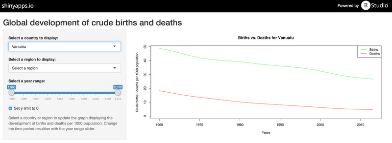

```{r setup,include=FALSE}
source("code/dataFunctions.R")
source("code/metricsFunctions.R")

# Prepare and load all source data and metadata files
birthSourceFile <- "data/sp.dyn.cbrt.in_Indicator_en_csv_v2.csv"
deathSourceFile <- "data/sp.dyn.cdrt.in_Indicator_en_csv_v2.csv"
sourceMetadataFile <- "data/Metadata_Country_sp.dyn.cbrt.in_Indicator_en_csv_v2.csv"

birthData <- parseSourceData(birthSourceFile)
deathData <- parseSourceData(deathSourceFile)
yearStart <- 1960
yearEnd   <- 2013
```

# Importance of understanding the demographic developments

The demographic development within a country or region is fundamental for decision making. For example an aging and declining population requires different strategies than a population which is getting younger.

Especially in developed countries there is a steady decline of population e.g. in Germany:
```{r, include=FALSE}
germanyBirths <- getMetrics(birthData,"DEU",yearStart,yearEnd)
germanyDeaths <- getMetrics(deathData,"DEU",yearStart,yearEnd)
xAxisYears <- yearStart:yearEnd
```
```{r, fig.width=9,fig.height=4, echo=FALSE}
plot(xAxisYears,germanyBirths, 
               type = "l", 
#                ylim = c(yMin,yMax), 
               col = "green", 
               ylab = "Crude births / deaths per 1000 population",
               xlab = "Years",
               main = "Births vs. Deaths for Germany")
lines(xAxisYears,germanyDeaths,col="red")
legend("topright", legend = c("Births", "Deaths"), col = c("green","red"), lty=c(1,1))  
```

--- .class #id 

# Births vs. Deaths App

Births vs. Deaths is an app to interactively explore the relationship between births and deaths in a selected country or region.

It is hosted on shinyapps.io and can be reached under the URL 

https://sebastianstoll.shinyapps.io/birthsvsdeaths-app/



--- .class #id 

# App Features

The app compares the births and deaths for a given country and region.

It features
* Country selection for all the worlds countries
* Selection of 33 different geographical or income regions
* Selection of the world as a special region
* Date range slider for specifying a time period of interest
* Two y axis modes for having a dynamic or fixed scaling
* Time series line plot comparing births and deaths

The app was realised using R and shinyapps from R Studio.

--- .class #id 

# Source Data 

The source data was taken from [World bank](http://data.worldbank.org) which is a repository containing data about development in countries around the globe.

In particular two data sets on crude births and deaths per 1000 population were used

[Crude births](http://data.worldbank.org/indicator/SP.DYN.CBRT.IN)   
[Crude deaths](http://data.worldbank.org/indicator/SP.DYN.CDRT.IN)

# References

[shinyapps.io](https://www.shinyapps.io)  
[R](http://www.r-project.org/)  
[R Studio](http://www.rstudio.com/)  
[World bank](http://data.worldbank.org)